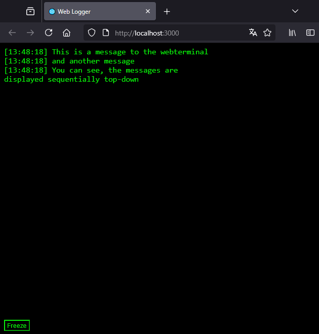

# go-weblogger

Expose your terminal output to the web

## usage

```go

func main() {


    wi := NewWebInterface("localhost", 3000)
    go wi.Start()

    fmt.Fprintln(wi.Writer, "This is a message to the webterminal")
    fmt.Fprintln(wi.Writer, "This is a second message")
    fmt.Fprintln(wi.Writer, "You can see, the messages are \n displayed sequentially top-down")
}
```


